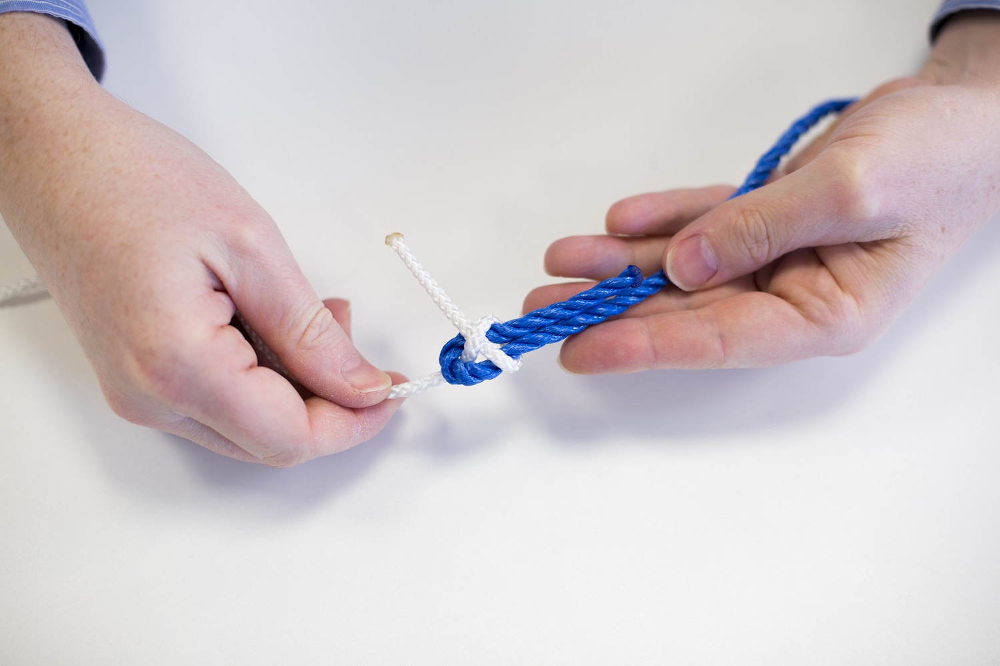

## Finishing the knot

Wrap rope 2 behind both uprights of the U in rope 1, then tuck rope 1 under itself, and pull the knot tight.

You now have a sheet bend and your ropes should remain firmly fastenned

This tutorial first appeared in HackSpace magazine issue 5, which you can download for free from [hsmag.cc](https://hsmag.cc){:target="_blank"}. Follow HackSpace magazine to get your fill of making every month.